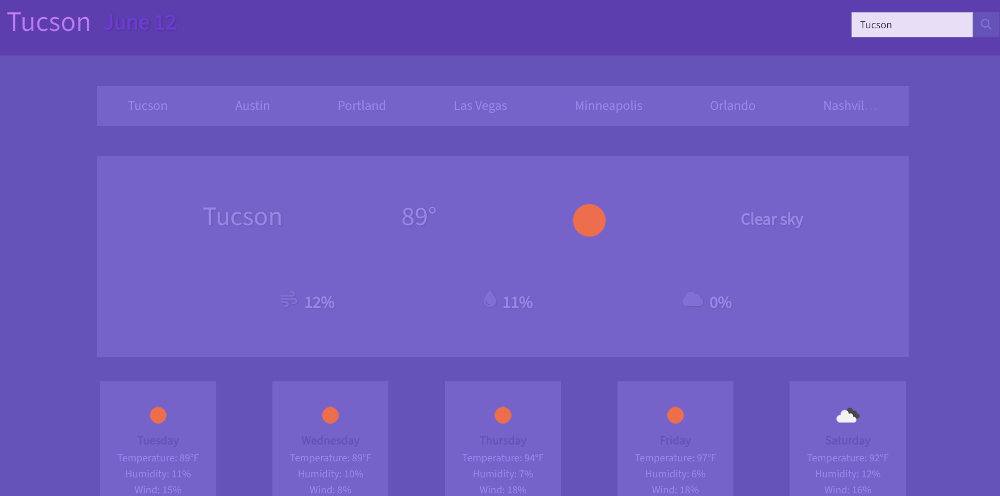

# Weather-In-Your-City

## Description

This simple weather application collects the user's city input and returns the city's current and future weather information using OpenWeatherMap's free <i>Current Weather Data</i> and <i>5 Day / 3 Hour Forecast</i> API's. The application was created for Denver University's Coding Boot Camp as part of a challenge assignment due 6/8. To satisfy criteria, the application provides search functionality that returns the name of the city the user entered, the current date, and current and forecasted weather conditions, including temperature, humidity, and wind speed, with corresponding weather icons. Additionally, the app provides basic local storage, which allows the user to select and view previous searches.

## Installation

N/A

## Usage

To use this weather dashboard, begin by navigating to https://msjamesm.github.io/Weather-In-Your-City in your browser. Enter the name of a city in the search box to the right of the page and click the 🔍 button, or hit ENTER on your keyboard. You should now see current and forecast weather conditions for the city you searched. (Note: spelling errors might return inaccurate results.) To view past search results, select your previously searched city from the navigation bar above the weather section.

## Screenshot

## Credits

https://day.js.org

https://openweathermap.org/api

https://github.com/prof3ssorSt3v3

https://developer.mozilla.org/en-US

## License

N/A
